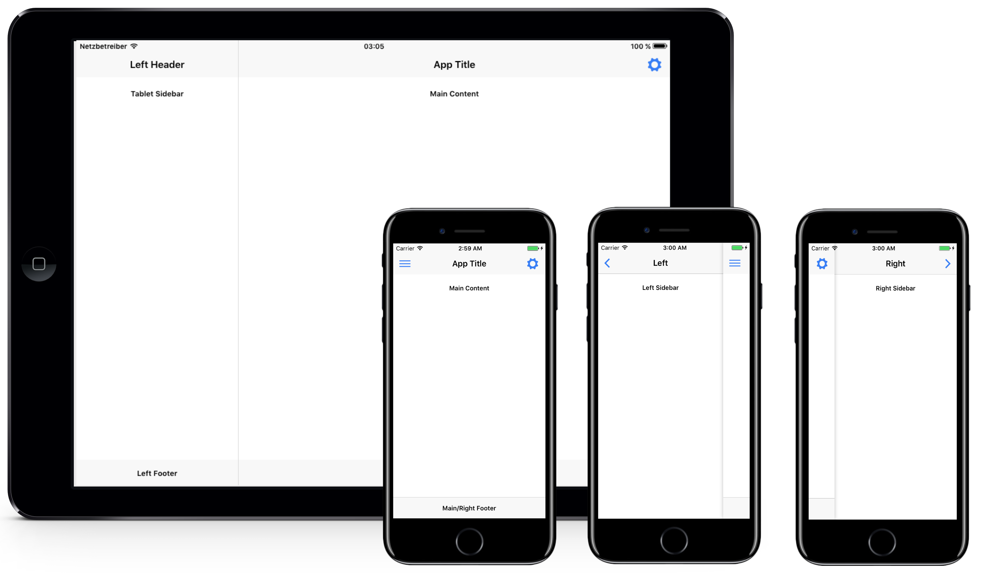
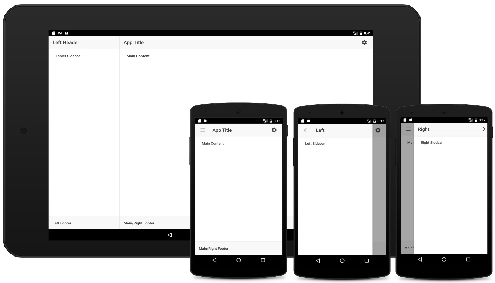

#Ionic 2: Splitview for iOS and Android works with Phones and Tablets

This solution doesn't use media queries, instead it is using the cordova plugin [isTablet](https://github.com/dpa99c/phonegap-istablet).

### iOS:

### Android:

## Installation

1. Download and unzip the project.

2. Run the following commands:

	    $ cd path/to/project
	    $ ionic platform add ios; ionic platform add android;
	    $ ionic run ios
		$ ionic run android

   
## Usage

The important things are happening in:

	src/pages/home/

## History

Version: 1.0

## Credits

– Christa

## License

MIT License (MIT)

Copyright (c) 2016 Jörg Holz | [https://www.workflow-management.net](https://www.workflow-management.net)